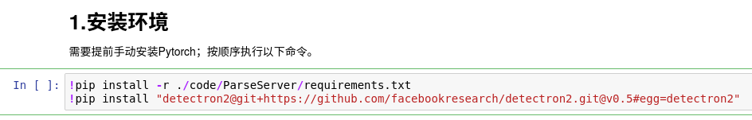
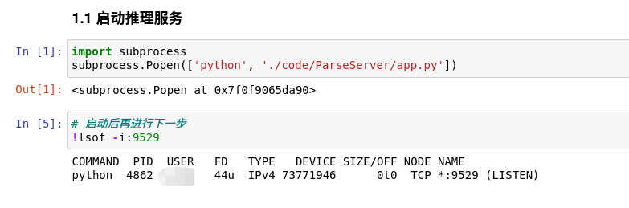
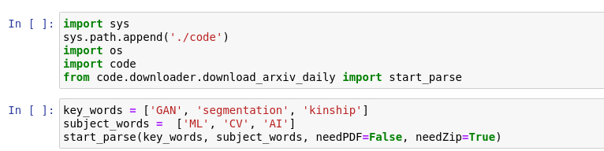
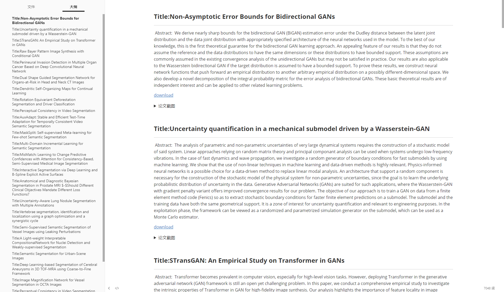
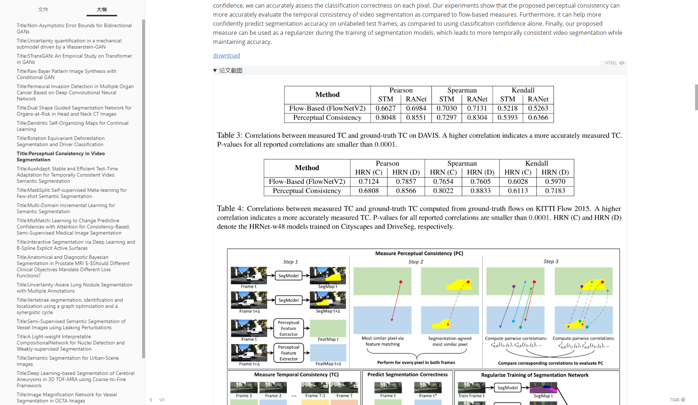

# Arxiv daily 速览
- **功能**：按关键词筛选arxiv每日最新paper，自动获取摘要，自动截取文中表格和图片。
- CPU加速推理版本上线https://github.com/wmpscc/FocusAX
## 1 测试环境
- Ubuntu 16+
- Python3.7
- torch 1.9
- **Colab GPU**

## 2 使用演示

首先[下载权重](https://drive.google.com/drive/folders/1q2BXmiBs22jzHFTPV-nClzxIsvRtvndx?usp=sharing)，放置于`code/ParseServer/models/PubLayNet/faster_rcnn_R_50_FPN_3x/model_final.pth`
- [备用链接](https://www.dropbox.com/s/dgy9c10wykk4lq4/model_final.pth?dl=1)
### 2.1 环境安装

可选择在本地使用或Colab使用，以本地使用为例。

- 1.提前安装Pytorch GPU版本
- 2.在本项目根目录启动jupyter notebook，运行`Overview_RUNME_Local.ipynb`
- 3.首次运行，先安装环境

- 4.运行文档版面分析服务，确认正常启动后再运行下一步

- 5.按照需要填写关键词进行筛选，如果需要PDF文件`needPDF=True`，需要将结果打包`needZip=True`

- 6.启动后，将同时进行下载和文档版面分析，截取需要的内容。下载的文件将保存在`./arxiv` 目录下，如果`needZip=True`，会产生 `./arxiv.zip` 文件。

### 2.2 Colab

- 将code目录压缩上传 google drive根目录
- 使用Colab运行`Overview_RUNME_Colab.ipynb`，后续步骤同2.1

## 3 效果展示

本地解压后，使用`Typora` markdown阅览工具可进行查看。

每个文件夹中的`abs.md`文件保留的是当前pdf的介绍。

ps:排版不规范会导致截图混乱，这也侧面说明了文章质量。

# 其他

ps:本着能用就行"堆屎山"代码，有bug描述清楚提issue，定期维护。
